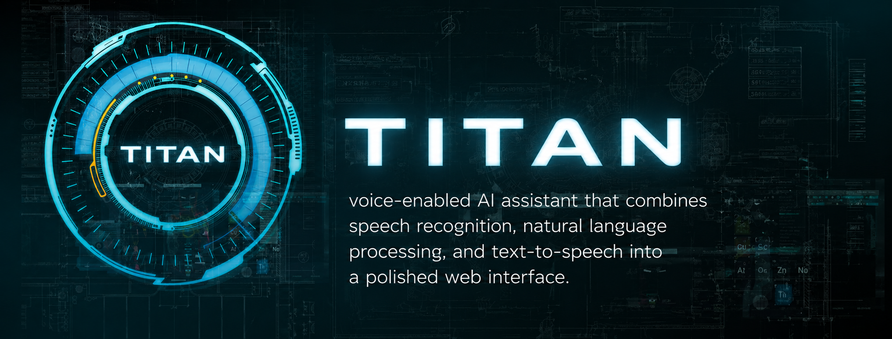
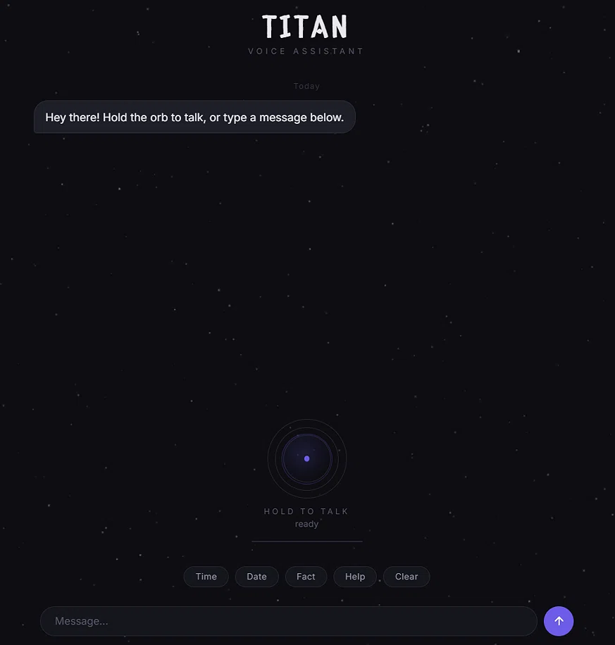
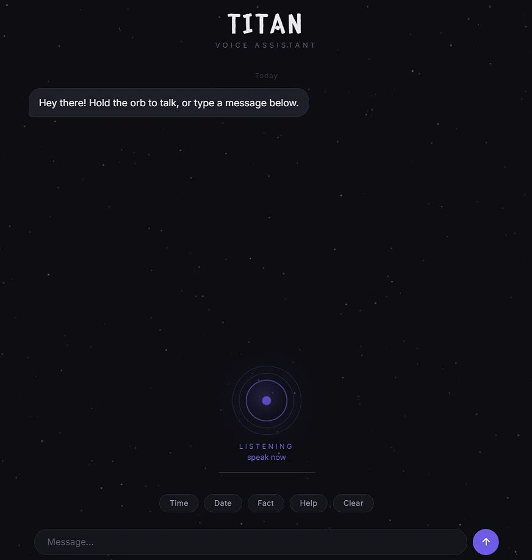

# TITAN (currently in development)

  

---

## Overview

TITAN is a voice-enabled AI assistant that combines speech recognition, natural language processing, and text-to-speech into a polished web interface. It will later include a local AI version so the user can use it offline as well.

Built with Flask and vanilla JavaScript — so it runs on any device.

Future versions will include RAG, App Integration, and Image/Video generation capabilities.

---

## Features

- **Voice-First Design** — Hold the central button to speak, release to send. Transcribed automatically.
- **Text Input** — Type messages when you can't use voice.
- **Audio Visualization** — (Might be changed later.)
- **TTS Playback** — AI responses are spoken back with Google TTS (pyttsx3 fallback).
- **System Commands** — Quick commands that does not use the AI.
- **Responsive** — Works on desktop, tablet, and mobile.

---

## Screenshots

  
  
<em>Idle state — waiting for input</em>

  
  
  
<em>Orb active — listening for voice input</em>

  
  
  
<em>Chat bubbles with iMessage-style design</em>

---

## Tech Stack

| Layer | Technology |
|-------|-----------|
| **Backend** | Python, Flask |
| **Frontend** | HTML5, CSS3, Vanilla JS |
| **AI/LLM** | OpenRouter API (can use any) |
| **Speech-to-Text** | Google Speech Recognition + pydub |
| **Text-to-Speech** | Google Translate TTS (pyttsx3 fallback) |

---

## Installation

### Prerequisites

- Python 3.8+
- pip
- ffmpeg (for pydub audio processing)
- flask
- requests
- SpeechRecognition
- pydub
- pyttsx3

#### Extra Prerequisites (Debian)

- ffmpeg
- espeak
- portaudio19-dev

 
Built by Davis and Nathan
 

